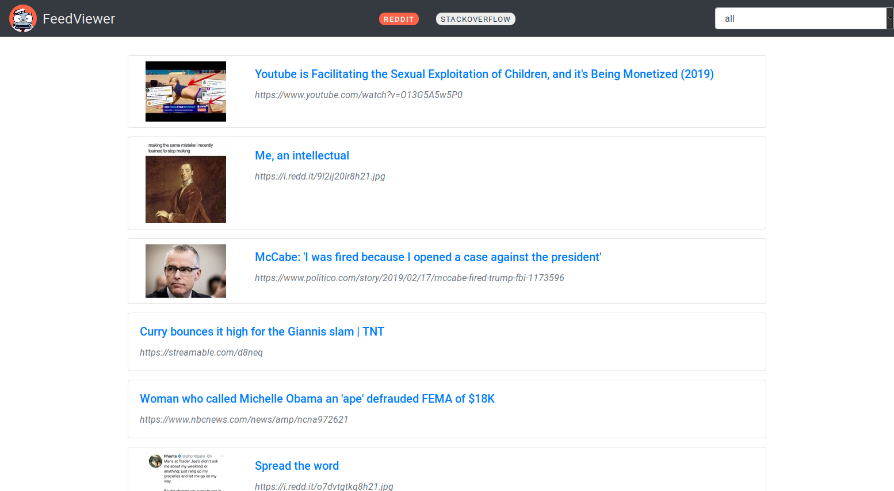

# FeedViewer
<p align="center"></p>

## About

This is a simple feed viewer project aims to demonstrate Gilbert use-case.
This project contains a simple single-page application and a few Go plugins.
Feed sources are provided as separate libraries.

## Installation and usage

### Prerequisites

- Go (1.12+)
- UNIX system (preferable Linux)
- [Gilbert](https://github.com/x1unix/gilbert) task runner

### Compilation

- Clone this project
```bash
git clone https://github.com/x1unix/demo-go-plugins.git
```
- Build project
```bash
gilbert run build
```

Build result will be located at `build` directory

- Run

```
gilbert run start   # or ./build/server
```

or run in **watch** mode with `gilbert run watch`


## Project structure

- `server` - Main HTTP server with feed client
- `sources/reddit` - Reddit plugin package
- `sources/stackexchange` - StackExchange plugin package
- `docs` - Misc files
  - `actions` - Helper project actions

### Data sources

Each data source is provided as separate plugin library that loaded by the server.
Each plugin should have entrypoint function and data source signature.

See `server/feed/sources` package for plugin load process information.

List of loaded data sources defined in configuration file.

### Configuration

```js
{
  "listen": "127.0.0.1:8080",   // <-- Interface to listen
  "debug": true,                // <-- Debug mode
  "sources": {                  // <-- Plugins to load and plugin config
    "./lib/reddit.so": {
      
      // Configuration for specific plugin
      "userAgent": "Mozilla/5.0 (X11; Ubuntu; Linux x86_64; rv:65.0) Gecko/20100101 Firefox/65.0",
      "subReddits": ["all","popular", "original"]
    },
    "./lib/stackexchange.so": {
      "site": "stackoverflow",
      "tags": ["go", "javascript", "php"]
    }
  }
}
```
